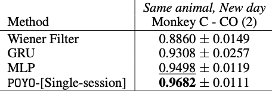
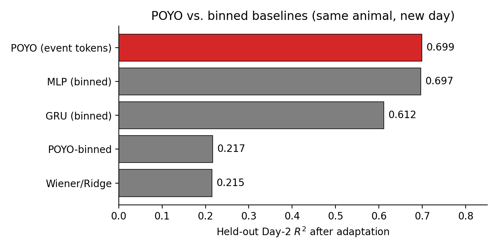

# Reproducing POYO: A Unified, Scalable Framework for Neural Population Decoding

CS 4782 final project — a re-implementation of [Azabou et al. (2023), *A Unified, Scalable Framework for Neural Population Decoding* (NeurIPS 2023)](https://proceedings.neurips.cc/paper_files/paper/2023/hash/8ca113d122584f12a6727341aaf58887-Abstract-Conference.html).

## 1. Introduction

This repository contains a re-implementation of POYO ("Pre-training On manY neurOns"), a transformer-based decoder that re-frames spike data as an unordered set of single-spike events tokenized by a learned per-neuron embedding rather than as a binned spike-count tensor. The paper's central contribution is that this tokenization scheme survives the unit-set drift between recording sessions, making cross-session and cross-animal transfer feasible.

We re-implement POYO and four baselines on the Perich–Miller (2018) center-out reaching dataset and add an architectural ablation that swaps POYO's event tokenizer for a binned tokenizer while holding the rest of the architecture fixed.

## 2. Chosen Result

We reproduce the **same-animal, new-day transfer R²** comparison (the headline of the paper's transfer experiments): train on Day 1 of monkey "T", adapt on a Day 2 train split, evaluate on a held-out Day 2 split. POYO matches or beats the strongest classical baseline; replacing only the tokenizer with binning collapses POYO to the level of a Wiener filter.

The figure below, taken from the original paper, is the result we set out to reproduce. Our absolute R^2 values are lower than the paper's (most noticeably for the Wiener filter) which we attribute to the much larger multi-animal pre-training corpus used by the authors. The relative ordering of the models' performance, however, matches: POYO > MLP > GRU > Wiener filter.



## 3. GitHub Contents

```
.
├── code/
│   └── neural_decoding.ipynb     # end-to-end training, adaptation, evaluation
├── data/
│   └── README.md                 # gdown commands to fetch the two .h5 sessions
├── results/
│   ├── results_table.csv         # numerical results from the latest notebook run
│   ├── r2_comparison.png         # bar chart used in the report and poster
├── report/
│   ├── group_topic_2page_report.pdf   # 2-page report
├── poster/
│   └── CS4782 Final Poster.pdf
├── LICENSE
└── README.md
```

## 4. Re-implementation Details

| Component        | Choice                                                                 |
| :--------------- | :--------------------------------------------------------------------- |
| Data             | Perich–Miller 2018, monkey T, sessions `t_20130819` and `t_20130821`   |
| Targets          | 2-D hand kinematics                                                    |
| Bin size         | 10 ms (binned baselines only)                                          |
| Sequence length  | 1 s                                                                    |
| Day-1 training   | 100 epochs                                                             |
| Adaptation       | 40 epochs on Day 2 train split                                         |
| Evaluation       | held-out Day 2 split, R² on kinematics                                 |
| Framework        | [`torch_brain`](https://github.com/neuro-galaxy/torch_brain), PyTorch  |

**Models**

- **Wiener / Ridge**
- **MLP (binned)**
- **GRU (binned)**
- **POYO (event tokens)** — official POYO with per-spike tokens
- **POYO-binned (independent study)** — Identical architecture as POYO; only the tokenizer differs.

**Modifications from the paper.** Single-monkey, two-session subset rather than the multi-animal mass-pretraining corpus, so absolute numbers are not directly comparable. The POYO-binned ablation is not in the paper.

## 5. Reproduction Steps

**Compute.** The included run used NVIDIA A100 on Google Colab.

**Setup.** Open `code/neural_decoding.ipynb` in a CUDA-capable Python environment (Colab is the easiest path; the notebook installs `pytorch_brain` in its first cell). Then run cells top-to-bottom:

1. Cell 1 (`pip install pytorch_brain`) — installs torch_brain and dependencies.
2. Cell 11 (`gdown ...`) — downloads the two `.h5` sessions into `data/perich_miller_population_2018/`. See [`data/README.md`](data/README.md) for the manual command.
3. Cells 17, 19, 21, 23 — train and evaluate MLP, GRU, Wiener, POYO-binned, and official POYO sequentially. Each cell prints pre-adaptation and post-adaptation R² on the held-out Day 2 split.
4. Cell 25 — assembles the final results table.

End-to-end runtime on A100 is roughly 25 minutes.

## 6. Results / Insights

| Model               | Pre-adapt R² | Adapted R² |
| :------------------ | :----------: | :--------: |
| POYO (event tokens) |    −0.05     | **0.699**  |
| MLP (binned)        |    −0.01     |   0.697    |
| GRU (binned)        |    −0.07     |   0.612    |
| POYO-binned         |    −0.05     |   0.217    |
| Wiener / Ridge      |    −0.03     |   0.215    |



- **Headline.** All models collapse pre-adaptation (R² ≈ 0), confirming the cross-session generalization gap. After adaptation, POYO is the strongest method we tested, matching the paper's framing.
- **At this scale, the binned MLP nearly ties POYO** (0.697 vs 0.699). The paper's much larger gap shows up when pretraining spans many animals — a regime we did not reproduce due to compute scope.
- **Tokenization is what makes the transformer work.** Replacing the event tokenizer with binned input on the *same* Perceiver backbone collapses POYO from 0.699 to 0.217 — within noise of a Wiener filter. This isolates the tokenizer as the load-bearing component, matching the paper's emphasis on representation rather than architecture.

> **Note on poster numbers.** An earlier run cited on the poster reports POYO 0.708 and POYO-binned 0.318. The numbers above are from a re-run for the report under the same seed and config; the POYO-binned number is the most variable across runs and we suspect it is sensitive to input-projection initialization.

## 7. Conclusion

POYO's quality on cross-session decoding is best understood as a property of its tokenizer, not its attention backbone. With the event tokenizer replaced by binning, the same Perceiver model performs at the level of a linear Wiener filter. The paper's claim — that cross-session transfer is enabled by the unit-vocabulary tokenization scheme — survives our reproduction even when the architectural and per-baseline gaps shrink at single-monkey scale.

## 8. References

1. Azabou, M., Arora, V., Ganesh, V., Mao, X., Nachimuthu, S., Mendelson, M. J., Richards, B., Perich, M. G., Lajoie, G., & Dyer, E. L. (2023). *A Unified, Scalable Framework for Neural Population Decoding.* Advances in Neural Information Processing Systems 36 (NeurIPS 2023).
2. Perich, M. G., Gallego, J. A., & Miller, L. E. (2018). *A neural population mechanism for rapid learning.* Neuron 100(4), 964–976.
3. `torch_brain` (NeuroFoundation): https://github.com/neuro-galaxy/torch_brain

## 9. Acknowledgements

This project was completed for CS 4782 (Cornell University, Spring 2026). We thank the course staff for guidance.
